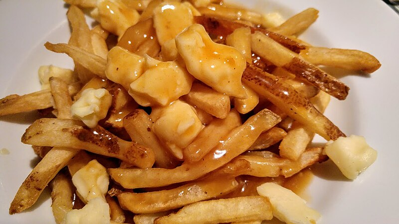

# Classic Poutine

Poutine is a popular Canadian dish that originated in Quebec. It traditionally consists of crispy French fries topped with cheese curds and smothered in a rich gravy. It's a comforting and indulgent dish that's perfect for a cozy night in or as a unique addition to any gathering.

### Cooking Time and Servings:
- Prep Time: 15 minutes
- Cook Time: 20-25 minutes
- This recipe makes approximately 4 servings of classic poutine, but you can adjust the quantities based on your needs. It's a great dish to share with friends or family as a delicious and satisfying snack or side dish.

### Ingredients:
- 4 large potatoes, washed and cut into fries
- 2 cups cheese curds
- Gravy (you can use store-bought or make your own)
- 4 oz (115g) pancetta or bacon, diced
- Gravy (you can use store-bought or make your own)
  - 2 tablespoons unsalted butter
  - 2 tablespoons all-purpose flour
  - 2 cups beef or chicken broth
  - Salt and pepper to taste

### Instructions

1. Preheat your oven to 450°F (230°C) and line a baking sheet with parchment paper.
2. Spread the cut potatoes in a single layer on the baking sheet. Drizzle with olive oil, season with salt and pepper, and toss to coat evenly.
3. Bake the fries in the preheated oven for 20-25 minutes or until golden brown and crispy, flipping them halfway through.
4. While the fries are baking, prepare the gravy. In a saucepan, melt the butter over medium heat. Add the flour and whisk constantly until the mixture turns golden brown, about 2-3 minutes.
5. Gradually whisk in the broth, making sure there are no lumps. Bring the mixture to a boil, then reduce the heat and simmer for 5-7 minutes, or until the gravy has thickened. Season with salt and pepper to taste.
6. Once the fries are done, remove them from the oven and transfer them to a serving dish. Sprinkle the cheese curds over the hot fries.
7. Pour the hot gravy over the fries and cheese curds, ensuring that the cheese begins to melt.
8. Serve immediately, allowing the cheese to melt further in the hot gravy.

Enjoy your homemade poutine!

### Nutritional Information (per serving):

- Calories: 550-650 kcal
- Fat: 30-40g
- Carbohydrates: 50-60g
- Protein: 20-25g
