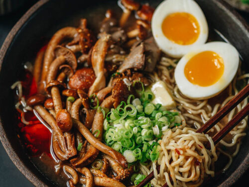

# Ramen

This homemade beef ramen is a comforting and flavorful dish that brings the authentic flavors of Japanese cuisine to your table. Tender slices of beef are simmered in a rich and savory broth, infused with the aromatic essence of garlic, ginger, and soy sauce. The addition of shiitake mushrooms adds an earthy depth to the broth, while fresh ramen noodles provide a satisfying chewiness. Topped with a perfectly soft-boiled egg, vibrant green onions, and optional garnishes like nori, corn, or bamboo shoots, each bowl is a hearty and satisfying meal. Whether enjoyed as a warming dinner or a special weekend treat, this beef ramen is sure to delight your taste buds with its comforting flavors and satisfying textures.

### Cooking Time and Servings:
- Slicing the beef and vegetables: 10-15 minutes
- Cooking the beef and broth: 20-25 minutes
- Boiling the eggs (if using): 5-7 minutes
- Cooking the noodles: 5-10 minutes
- Assembling the ramen bowls: 5 minutes
- Yield: 4 servings

### Ingredients:
- 1 pound (450g) beef (such as sirloin or flank steak), thinly sliced
- 8 cups (1.9 liters) beef broth
- 4 packs of fresh ramen noodles (or you can make your own if you prefer)
- 4 green onions, chopped
- 4 large eggs
- 1 cup (240ml) shiitake mushrooms, sliced
- 2 tablespoons soy sauce
- 1 tablespoon mirin (Japanese sweet rice wine)
- 1 tablespoon sesame oil
- 1 tablespoon grated ginger
- 4 cloves garlic, minced
- Salt and pepper to taste
- Optional toppings: nori (seaweed sheets), corn kernels, bamboo shoots, bean sprouts, chili oil

### Instructions:
1. In a large pot, heat the sesame oil over medium heat. 2. Add the garlic and ginger, and sauté for about 1 minute until fragrant.
2. Add the beef slices to the pot and cook until browned, about 2-3 minutes.
3. Pour in the beef broth, soy sauce, and mirin. Bring to a boil, then reduce the heat and let it simmer for about 15 minutes to allow the flavors to meld.
4. While the broth is simmering, prepare the eggs. You can soft boil them for 5-7 minutes or until the whites are set but the yolks are still runny. Once cooked, peel and set aside.
5. In a separate pot, cook the fresh ramen noodles according to the package instructions. Drain and set aside.
6. Divide the cooked noodles among four bowls. Ladle the beef broth over the noodles, making sure to distribute the beef slices evenly.
7. Top each bowl with a soft-boiled egg, sliced shiitake mushrooms, and chopped green onions.

Enjoy your homemade beef ramen! Feel free to adjust the seasonings and toppings to suit your taste.

### Tips and Variations:
- If desired, add optional toppings like nori, corn kernels, bamboo shoots, bean sprouts, or a drizzle of chili oil.

### Nutritional Information (per serving):
- Calories: Around 500-600 calories per serving
- Protein: Approximately 25-30 grams per serving
- Fat: Approximately 15-20 grams per serving
- Carbohydrates: Around 60-70 grams per serving
- Fiber: Roughly 3-5 grams per serving
